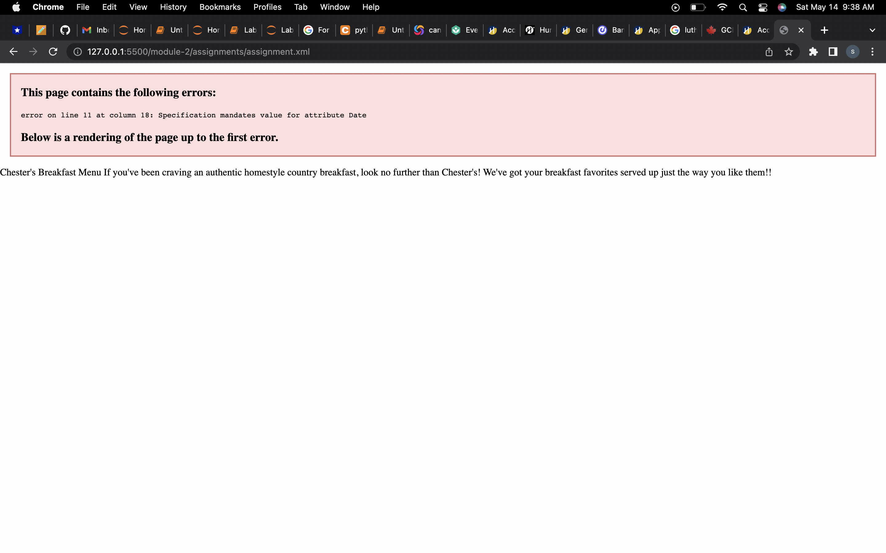
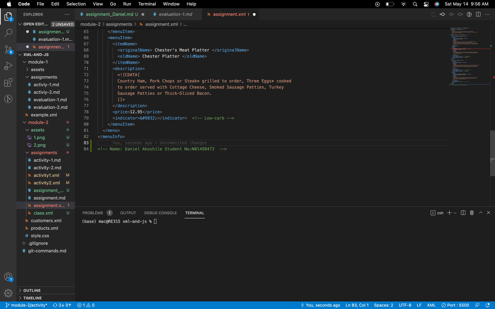
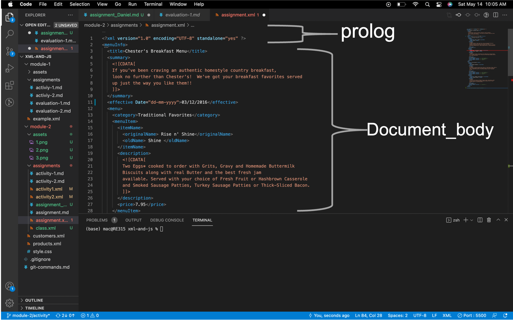
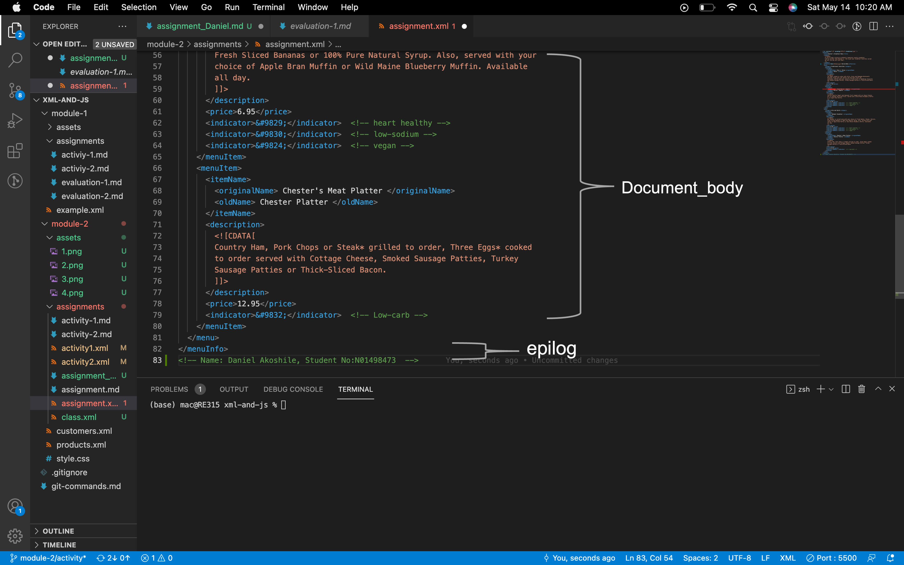
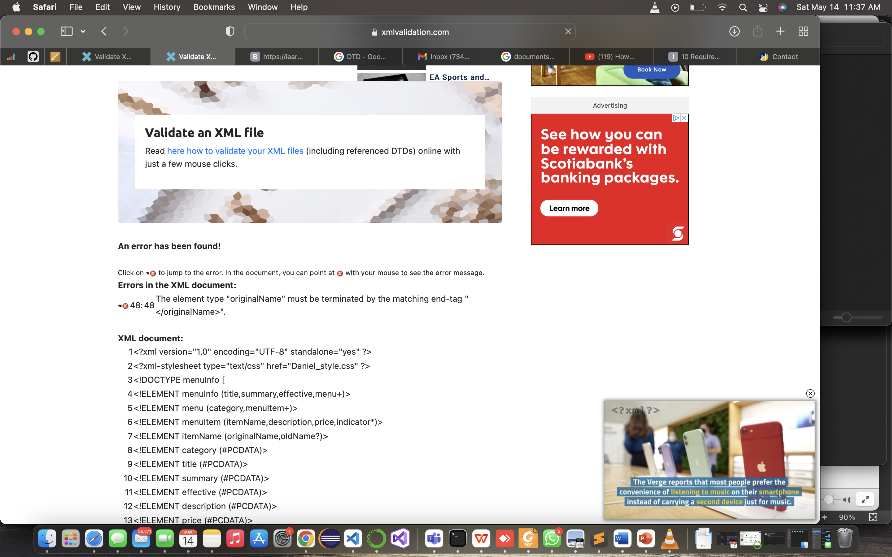
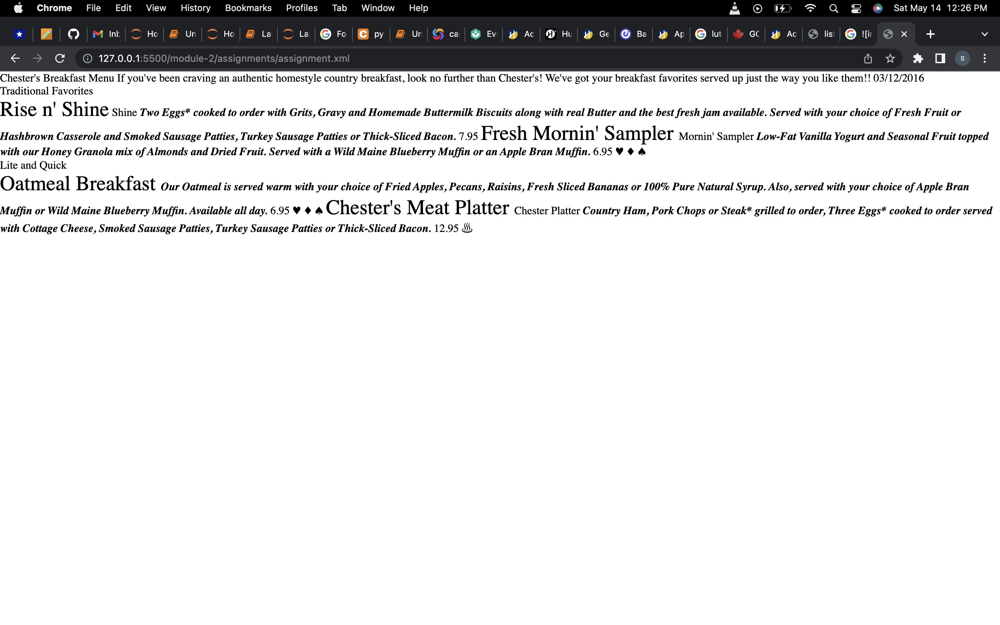

# Question 1
 Yes there is an error.

 which states Specification mandates value for attribute Date. And also Date is included in the closing tag (effective), an attribute is only included in the opening tag and there as to be a value for the attribute (Date).
 <effective_Date>03/12/2016</effective_Date>
 or 
 <effective Date=”dd/mm/yyyy”>03/12/2016</effective>

 # Question2. 
 The CDATA section treats the block of the XML as character data only.

 # Question3. 
 

 # Question4. 

 There is no processing instruction in the XML document.

 # Question5. 

# Question6. 

